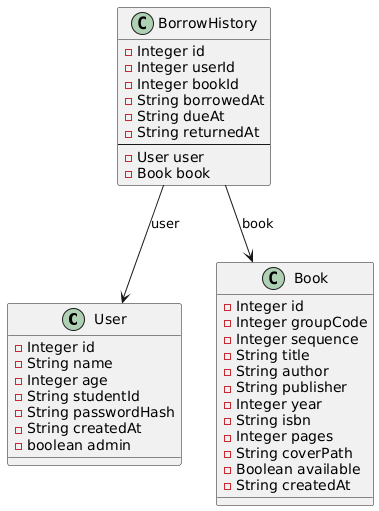

# Relatório Técnico — CallbackFX

## Objetivo e modelagem do projeto
O projeto CallbackFX propõe um framework acadêmico para construção rápida de telas JavaFX baseadas em anotações. A modelagem se ancora em quatro camadas principais:
- **Anotações de tela:** `@Screen`, `@ScreenField` e correlatas descrevem layout, dimensões e mapeamento de componentes, permitindo que o `AnnotationProcessor` gere a infraestrutura de binding sem codificação manual de FXML.
- **Function Set:** o conceito de `WindowFunction` agrupa os modos de operação (consulta, cadastro, edição e exclusão) e, aliado ao `AcceptMode`, controla automaticamente qual subconjunto de campos fica disponível em cada fluxo de trabalho.
- **Orquestração de eventos:** `ScreenManager`, `EventBinder` e `CallbackInvoker` mantêm o ciclo de vida das janelas, aplicam temas (PrimerLight) e interligam eventos JavaFX aos callbacks nomeados conforme convenção (`callback<Prefixo><Campo>`).
- **Persistência modularizada:** os DAOs Jdbi (`BookDao`, `UserDao`, `BorrowHistoryDao`) isolam regras de acesso ao banco SQLite, enquanto modelos (`Book`, `User`, `BorrowHistory`) materializam as entidades centrais para o Function Set e para o catálogo de livros.

O fluxo padrão inicia pelo `StartApplication`, que prepara o tema, inicializa o `ScreenManager` e direciona o usuário para a `WithdrawView`. A transição para as demais telas ocorre via rotas controladas, garantindo que a mesma base de callbacks sirva tanto ao conjunto de funções administrativas quanto às operações do acervo de livros.

## Requisitos funcionais
- **Autenticação e sessão:** tela de login (`LoginView`) com persistência de usuário logado em `UserData` e redirecionamento automático para dashboard ou manutenção, conforme função selecionada.
- **Function Set administrativo:** cadastro, consulta, atualização e exclusão de usuários e livros configurados por `WindowFunction`, com retorno opcional à tela anterior e controle dinâmico de habilitação de campos (`acceptKey`/`acceptData`).
- **Gestão de acervo:** manutenção de livros com agrupamento por código de coleção (`BookCodeUtils`), replicação de exemplares, validações de ISBN/ano/páginas e exibição de capas padrão.
- **Retirada e devolução de livros:** fluxo em `WithdrawController` que identifica livros por código, ISBN ou sequência, verifica disponibilidade, registra empréstimos e devoluções, e alerta usuários não autenticados.
- **Dashboard contextual:** painel administrativo com visão de usuários e livros agrupados; painel do leitor com histórico, estado de cada empréstimo e destaque de atrasos segundo regras de 14 dias.

## Requisito técnico
- Implementação em Java 17 com modularização (`module-info.java`) e build Maven (`mvnw`) para facilitar a reprodução do ambiente.
- Interface gráfica em JavaFX 17, estilizada pelo tema `atlantafx-base`, sem necessidade de arquivos FXML graças ao processador de anotações.
- Persistência desacoplada através do Jdbi 3 (módulos `core`, `sqlobject`, `sqlite`, `jpa`) conectada a banco SQLite (`sqlite-jdbc`), com singletons (`DatabaseManager`, `DaoFactory`) para gestão do ciclo de vida das conexões.
- Tratamento de callbacks e elementos customizados via components JavaFX (`TextEntryLabel`, `CheckEntryLabel`) para garantir consistência nas telas geradas.
- Execução padronizada pelo plugin `javafx-maven-plugin`, permitindo `mvn clean javafx:run` como ponto único de inicialização do protótipo.

## Limitações e trabalhos futuros
- Validação de dados distribuída entre controladores; sugere-se consolidar regras em camada dedicada para reuso entre Function Set e operações de empréstimo.
- Falta de testes automatizados para DAOs e fluxos críticos (login, retirada), o que dificulta regressão controlada.
- Ausência de controle de concorrência ou bloqueio otimista nas transações de livros; múltiplas retiradas simultâneas podem gerar inconsistências.
- Gestão de arquivos de capa centrada em recursos estáticos; futuros trabalhos podem integrar upload dinâmico e armazenamento externo.
- Necessidade de internacionalização e acessibilidade na camada de apresentação, hoje focada exclusivamente em português e teclado padrão.
- Criação de novas Entrys do framework e mais compoenentes complexos.

## UML

